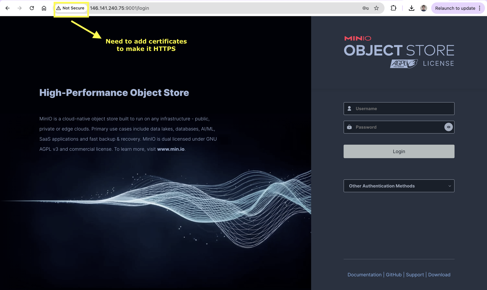

## MinIO on Single Node (Linux)
We'll be installing a single-node-multi-drive (SNMD) instance of [Minio](https://min.io/docs/minio/linux/operations/install-deploy-manage/deploy-minio-single-node-multi-drive.html) on a bare-metal Ubuntu machine (hostname `cloud05`). To install on an Ubuntu machine, run the following:
```bash
wget https://dl.min.io/server/minio/release/linux-amd64/archive/minio_20250422221226.0.0_amd64.deb -O minio.deb
sudo dpkg -i minio.deb
```
The `.deb` package will install the following systemd service file to `/usr/lib/systemd/system/minio.service`. In other cases, we'd need to create a `minio.service` file ourselves with the following content:
```bash
[Unit]
Description=MinIO
Documentation=https://min.io/docs/minio/linux/index.html
Wants=network-online.target
After=network-online.target
AssertFileIsExecutable=/usr/local/bin/minio

[Service]
WorkingDirectory=/usr/local

User=minio-user
Group=minio-user
ProtectProc=invisible

EnvironmentFile=-/etc/default/minio
ExecStartPre=/bin/bash -c "if [ -z \"${MINIO_VOLUMES}\" ]; then echo \"Variable MINIO_VOLUMES not set in /etc/default/minio\"; exit 1; fi"
ExecStart=/usr/local/bin/minio server $MINIO_OPTS $MINIO_VOLUMES

# MinIO RELEASE.2023-05-04T21-44-30Z adds support for Type=notify (https://www.freedesktop.org/software/systemd/man/systemd.service.html#Type=)
# This may improve systemctl setups where other services use `After=minio.server`
# Uncomment the line to enable the functionality
# Type=notify

# Let systemd restart this service always
Restart=always

# Specifies the maximum file descriptor number that can be opened by this process
LimitNOFILE=65536

# Specifies the maximum number of threads this process can create
TasksMax=infinity

# Disable timeout logic and wait until process is stopped
TimeoutStopSec=infinity
SendSIGKILL=no

[Install]
WantedBy=multi-user.target

# Built for ${project.name}-${project.version} (${project.name})
```
By default, the `minio.service` file runs as the `minio-user` user and group by default.   

We create the `minio-user` user and group as follows:
```bash
sudo groupadd -r minio-user
sudo useradd -M -r -g minio-user minio-user
```
We then give this user/group ownership of the dedicated drives allocated for MinIO usage, i.e.,
```bash
mkdir /mnt/drive-{1..4}
sudo chown minio-user:minio-user /mnt/drive-1 /mnt/drive-2 /mnt/drive-3 /mnt/drive-4
```
We need to create an environment variable file at `/etc/default/minio` with the following content as a start:
```bash
# MINIO_ROOT_USER and MINIO_ROOT_PASSWORD sets the root account for the MinIO server.
# This user has unrestricted permissions to perform S3 and administrative API operations on any resource in the deployment.
# Omit to use the default values 'minioadmin:minioadmin'.
# MinIO recommends setting non-default values as a best practice, regardless of environment.

MINIO_ROOT_USER=myminioadmin
MINIO_ROOT_PASSWORD=minio-secret-key-change-me

# MINIO_VOLUMES sets the storage volumes or paths to use for the MinIO server.
# The specified path uses MinIO expansion notation to denote a sequential series of drives between 1 and 4, inclusive.
# All drives or paths included in the expanded drive list must exist *and* be empty or freshly formatted for MinIO to start successfully.

MINIO_VOLUMES="/mnt/drive-{1...4}"

# MINIO_OPTS sets any additional commandline options to pass to the MinIO server.
# For example, `--console-address :9001` sets the MinIO Console listen port
MINIO_OPTS="--console-address :9001"
``` 
We can start the MinIO service with the following command:
```bash
sudo systemctl start minio.service
```
To confirm that the service is up and running, we can run:
```bash
sudo systemctl status minio.service
journalctl -f -u minio.service
```
    
To ensure that MinIO starts up when the host is booted, we need to run:
```bash
sudo systemctl enable minio.service
```
We need to ensure that the firewall allows for ports 9000 and 9001 to be open. Since we are using `iptables`, we run the following to open ports 9000 and 9001, respectively:
```bash
sudo iptables -I INPUT -p tcp -s 0.0.0.0/0 --dport 9000 -j ACCEPT
sudo iptables -I INPUT -p tcp -s 0.0.0.0/0 --dport 9001 -j ACCEPT
```
Our current deployment of MinIO is not secure, i.e. it is running with HTTP and not HTTPS. To secure it, we need to use the certificates given to us by the Wits ICT. These certificates need to be added to the `/opt/minio/certs` directory and renamed `private.key` and `public.crt`, respectively. Alternatively, the certificates can be copied to `/root/.minio/certs` (this is the default).   

After the certificates have been added, the following command will start the MinIO server with the certificates recognised:
```bash
sudo minio server --certs-dir /opt/minio/certs /mnt/drive-{1...4}
```   

### Installing the MinIO Client
To download and install the MinIO client, run the following:
```bash
curl https://dl.min.io/client/mc/release/linux-amd64/mc \
  --create-dirs \
  -o $HOME/minio-binaries/mc

chmod +x $HOME/minio-binaries/mc
export PATH=$PATH:$HOME/minio-binaries/

mc --help
```
Then set an alias, provide the hostname, and give both the access keys and secret keys, respectively:
```bash
bash +o history
mc alias set ALIAS HOSTNAME ACCESS_KEY SECRET_KEY
bash -o history
```
The following is an example:
```bash
mc alias set minio-user https://cloud05.core.wits.ac.za:9000 my_access_key my_secret_key
```
The connection to the MinIO server can be tested with:
```bash
mc admin info minio-user
```
